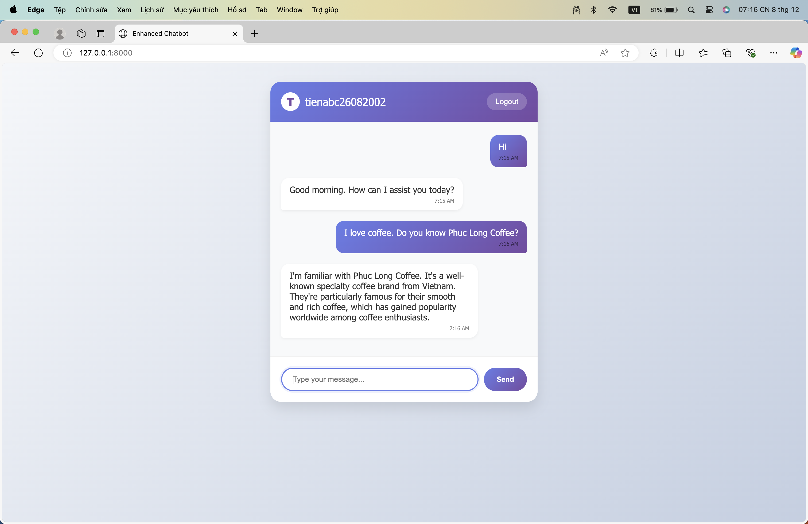

# ChatBot Authentication System

 <!-- Replace with your logo path -->

## Table of Contents

- [Overview](#overview)
- [Features](#features)
- [Technologies Used](#technologies-used)
- [Installation](#installation)
- [Configuration](#configuration)
- [Usage](#usage)
- [Project Structure](#project-structure)
- [Contributing](#contributing)
- [License](#license)
- [Contact](#contact)

## Overview

The **ChatBot Authentication System** is a web application built with Django that provides user authentication functionalities, including user registration, login, password reset via One-Time Password (OTP), and secure password management. The application features a modern and responsive user interface designed with HTML, CSS, and JavaScript.

## Features

- **User Registration:** Users can create an account by providing their full name, account name, email, and password.
- **User Login:** Registered users can log in using their account name and password.
- **Forgot Password:** Users can request a password reset by entering their registered email address.
- **Password Reset via OTP:** An OTP is sent to the user's email for verification. Users can set a new password after entering the correct OTP.
- **Responsive Design:** The application is designed to be responsive and user-friendly across various devices.
- **Secure Password Handling:** Passwords are securely hashed and stored in the database, with CSRF protection implemented for all forms.

## Technologies Used

- **Backend:**
  - [Django](https://www.djangoproject.com/) - A high-level Python web framework.
- **Frontend:**
  - HTML5
  - CSS3
  - JavaScript (ES6)
- **Database:**
  - PostgreSql (default, can be replaced with other databases)
- **Other Tools:**
  - [Bootstrap](https://getbootstrap.com/) (optional) - For additional UI components.

## Installation

Follow these steps to set up the project locally:

### Prerequisites

- Python 3.x installed on your machine.
- [pip](https://pip.pypa.io/en/stable/) package installer.
- [Git](https://git-scm.com/) installed.

### Steps

1. **Clone the Repository:**

   ```bash
   git clone https://github.com/MinhTienTH/Intelligent-RAG-system.git
   cd chatbot-authentication
   ```

2. **Create a Virtual Environment:**

   ```bash
   python -m venv venv
   ```

3. **Activate the Virtual Environment:**

   - **Windows:**

     ```bash
     venv\Scripts\activate
     ```

   - **macOS/Linux:**

     ```bash
     source venv/bin/activate
     ```

4. **Install Dependencies:**

   ```bash
   pip install -r requirements.txt
   ```

5. **Apply Migrations:**

   ```bash
   python manage.py migrate
   ```

6. **Create a Superuser (Optional):**

   ```bash
   python manage.py createsuperuser
   ```

7. **Run the Development Server:**

   ```bash
   python manage.py runserver
   ```

8. **Access the Application:**

   Open your web browser and navigate to `http://127.0.0.1:8000/`.

## Configuration

### Environment Variables (Optional)

For security purposes, it's recommended to use environment variables to store sensitive information like email credentials. You can use packages like [django-environ](https://github.com/joke2k/django-environ) to manage environment variables.

## Usage

### 1. **Signup**

- Navigate to the **Create Account** page.
- Fill in the registration form with your full name, desired account name, email, and password.
- Submit the form to create a new account.

### 2. **Login**

- Navigate to the **Login** page.
- Enter your account name and password.
- Click **Log In** to access your account.

### 3. **Forgot Password**

- On the **Login** page, click **Forgot Password?**.
- Enter your registered email address.
- An OTP will be sent to your email for verification.

### 4. **Reset Password**

- After receiving the OTP, navigate to the **Reset Password** page.
- Enter the OTP and your new password.
- Submit the form to reset your password and log in with the new credentials.

### Key Directories and Files

- **chatbot/**: Contains project-wide settings and configurations.
- **qa_auto/**: Contains application-specific code, including forms, models, views, and URL configurations.
- **templates/**: HTML templates for various pages like login, signup, forgot password, and reset password.
- **static/**: Static files such as CSS and JavaScript.
- **manage.py**: Django's command-line utility for administrative tasks.
- **requirements.txt**: Lists all Python dependencies.

## Contributing

Contributions are welcome! Follow these steps to contribute:

1. **Fork the Repository:**

   Click the **Fork** button at the top right of the repository page.

2. **Create a Branch:**

   ```bash
   git checkout -b feature/YourFeatureName
   ```

3. **Commit Your Changes:**

   ```bash
   git commit -m "Add some feature"
   ```

4. **Push to the Branch:**

   ```bash
   git push origin feature/YourFeatureName
   ```

5. **Open a Pull Request:**

   Go to the original repository and click **New Pull Request**.

## License

This project is licensed under the [MIT License](LICENSE). You are free to use, modify, and distribute this software.

## Contact

For any inquiries or support, please contact:

- **Your Name**
- **Email:** tiennm26082002@gmail.com
- **LinkedIn:** [linkedin.com/in/yourprofile](https://www.linkedin.com/in/tiennguyen2608/)

---

*This README was generated to provide a comprehensive guide for setting up and using the ChatBot Authentication System. For any further assistance, feel free to reach out.*
